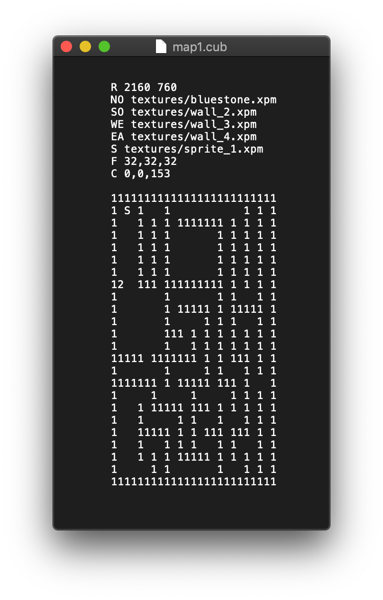

# 2Dto3D :milky_way:
Want to create your own simple 3D world?\
Put in an ASCII map, 2Dto3D will take care of the rest. :metal:\
It can transform a plain txt map like this;\
\
to be a [Wolfenstein_3D](https://en.wikipedia.org/wiki/Wolfenstein_3D)-like 3D world like this;\
\
All of the features were implemented without any help from external libraries. :star:
### Requirements
This project relies on MiniLibX and can be run only on MacOS.
### Installations
Run the following command in your terminal. You should see the window similar to the above screenshot.
```shell
cd ~/Downloads && git clone https://github.com/kabelt/2Dto3D.git 2Dto3D && cd 2Dto3D && make && ./2Dto3D maps/map1.cub
```
### Controls
| KEY           | Action        |
| ------------- |:-------------:|
| `W`           | move forward  |
| `S`           | move backward |
| `A`           | move to the left     |
| `D`           | move to the right    |
| `→`           | turn right    |
| `←`           | turn left     |
| `M`           | enable/disable minimap|
| `L`           | enable/disable shadow effect|
| `ESC`         | exit      |
### Features
- [x] Collision detection
- [x] [Sprites](https://en.wikipedia.org/wiki/Sprite_(computer_graphics))
- [x] Different wall texturing based on directions
- [x] Customizable wall/ceiling colors
- [x] Shadow effect based on distance
- [x] Minimap
### It's time to create you own world!
You can find the details about how .cub files works [here](subject/en.subject.pdf) on page 6-9.\
Then relaunch 2Dto3D with your map;
```shell
./2Dto3D <your_map>
```
### Acknowledgements
This project is part of 42 pedagogy originally named as Cub3D.
